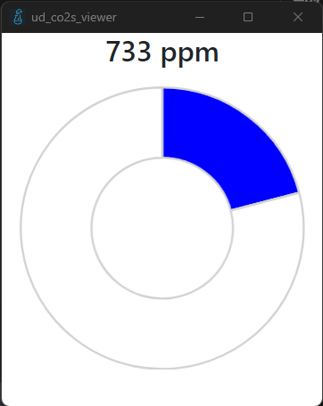

# ud_co2s_viewer
[ud_co2s_server](https://github.com/rakkyo150/ud_co2s_server)とともに使うことで酸素濃度が分かります。  
[ここ](https://github.com/rakkyo150/ud_co2s_viewer/releases)からダウンロードできます。  

## 使い方
起動時はウインドウは隠すようにしているので、システムトレイから表示してください。  
初回起動時はud_co2s_serverで設定したIPアドレスをポート番号まで入力する必要があります。  
たとえば、`192.168.xxx.xxx:xxxx`と入力することになります。  
入力が終わったらOKボタンを押して、以下のような画面になったら成功です。

あとは適宜PC起動時に自動起動するようにするなどの設定をしてください。
